# VM_Azure
### Jhorman Mera
Azure VM using Terraform and modules

* ## Requerimientos:
    * Sistema operativo con terraform instalado:
        * [Instalar terraform en linux](https://developer.hashicorp.com/terraform/tutorials/aws-get-started/install-cli)
        * [Instalar Terraform en Windows](https://learn.microsoft.com/es-es/azure/developer/terraform/get-started-windows-bash?tabs=bash) 

    * Azure Cli instalado con la sesión de azure iniciada, para esto se puede seguir la guía de [instalar azure-cli](https://learn.microsoft.com/es-es/cli/azure/install-azure-cli-linux?pivots=apt) de hashicorp
    * Archivo ````terraform.tfvars```` con los valores para las variables definidas en el archivo ````variables.tf````

* ## Pasos a seguir:

* Después de haber definido la IaC usando terraform y la funcion de modulos donde se obtiene una ip pública para nuestra Vm y se le habilita la gestión por ssh tenemos:

    * ### Modulo VM

        * Azure Public IP.
        * Azure Network Interface.
        * Azure Network Security Group.
        * Azure Network Interface Security
        * Group Association.
        * Azure Network Security Rule.
        * Azure Virtual Machine.
            * Storage OS Disk.
    
    * ### Main
        * Azure Resource Group.
        * Azure Virtual Network.
        * Azure Subnet.
        * VM Module

* El archivo [variables](variables.tf) contiene las definiciones de variables que serán utilizadas en los archivos de configuración de Terraform (como [main](main.tf), [outputs](outputs.tf), etc.). Estas variables pueden ser utilizadas para parametrizar la configuración de la infraestructura y permitir una mayor flexibilidad y reutilización del código.

* Dentro de la carpeta de [módulos](./modules/) de Terraform, el archivo [variables](./modules/vm/variables.tf) contiene las definiciones de variables específicas para ese módulo en particular. Los módulos en Terraform son conjuntos de recursos y configuraciones que se pueden reutilizar en diferentes proyectos de Terraform.

* El archivo [terraform](terraform.tfvars) un archivo de variables específico de Terraform que se utiliza para definir valores específicos para las variables declaradas en los archivos de configuración de Terraform, como el archivo de [variables](variables.tf). Este archivo es opcional, pero es una práctica común para proporcionar valores específicos para las variables en lugar de especificarlos directamente en los comandos de Terraform o en otros archivos.

* ## Comandos

1. Preparar el directorio de trabajo para trabajar con terraform ````terraform init````

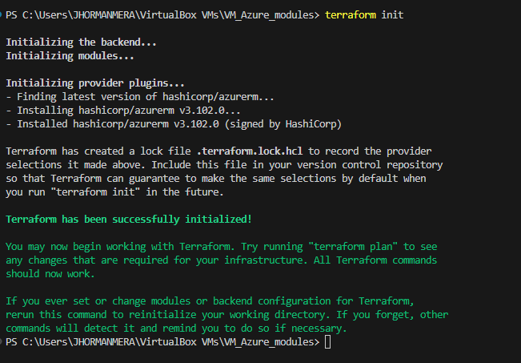

2. Validar la configuración de terraform ````terraform validate````

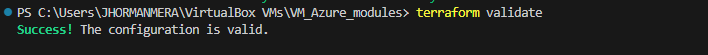.

3. Validar y mostrar los cambios requeridos para aplicar la configuración de la infraestructura ````terraform plan````

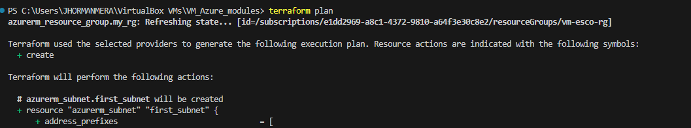
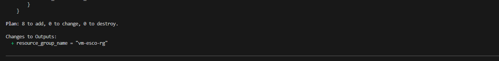

4. Aplicar un formateo en el archivo de definición que se crea con terraform ````terraform fmt````
5. Crear la infraestructura ````terraform apply````

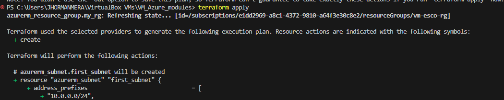

Es necesario estar atentos a esta parte del aprovisionamiento para confirmar los cambios a realizar por terraform escribiendo ```yes``` en la consola

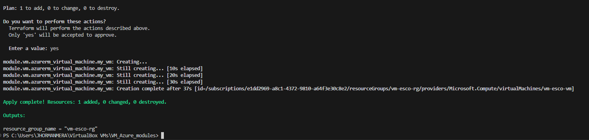

### Evidencia del dashboard de Azure

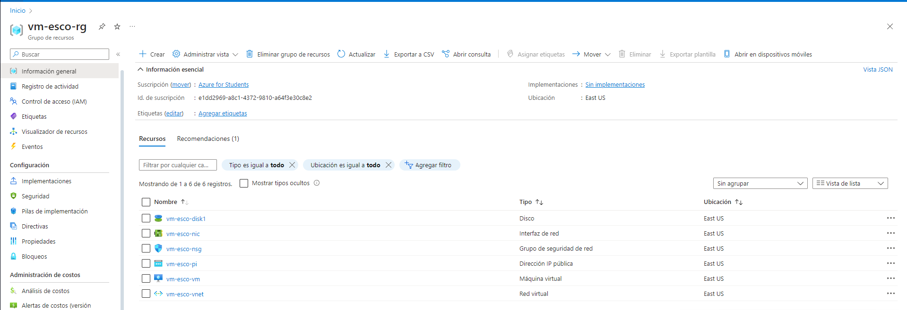

6. En caso de necesitar eliminar la infraestructura, se usa el comando ````terraform destroy````

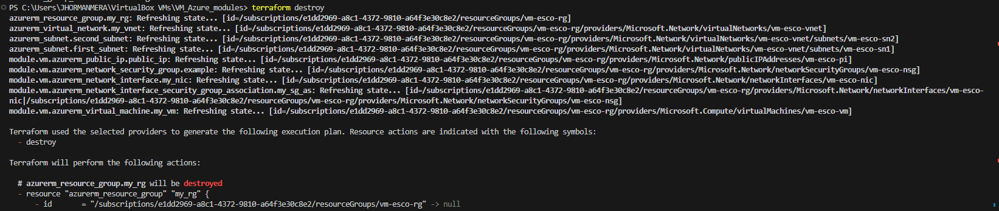
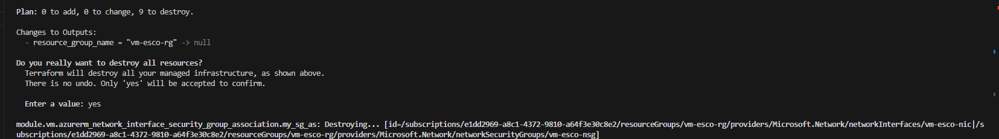
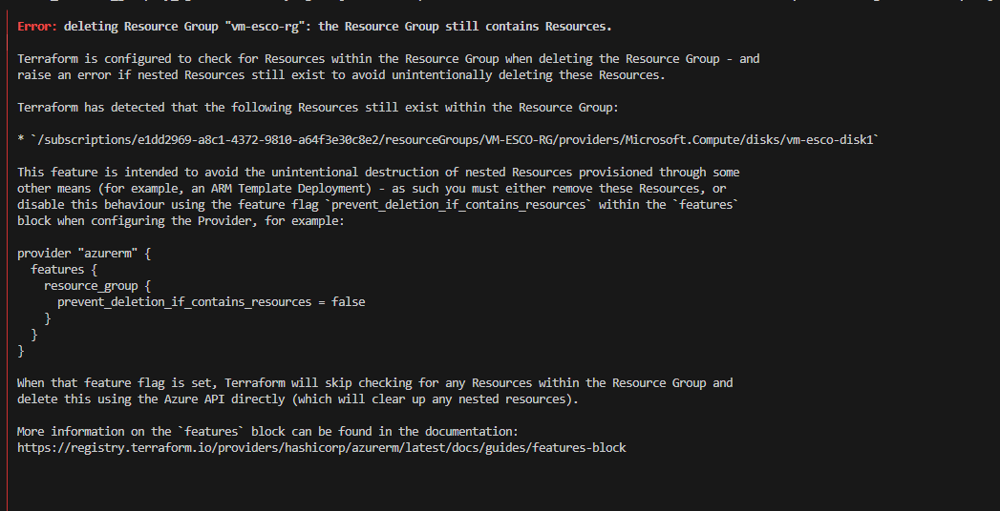

Nota: Se debe eliminar manualmente el disco que estaba usando la Vm para poder eliminar posteriormente el grupo de recursos

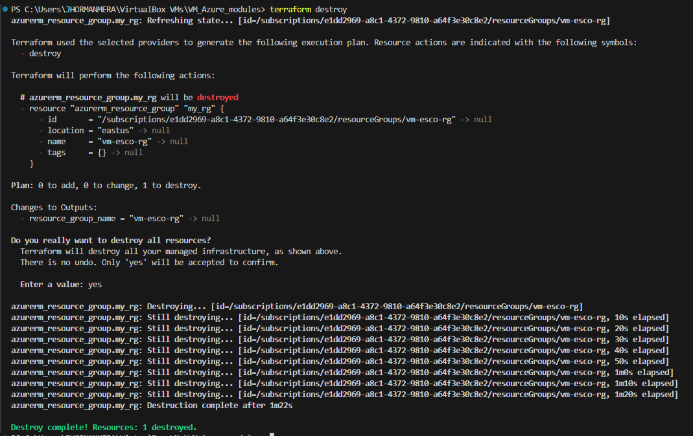

* ## Consideraciones

Fue necesario agregar en el archivo [main.tf](./main.tf), un apartado de `depends_on` al llamado del módulo de la VM para evitar errores en el aprovisionamiento debido a que se estaba creando este recurso antes de la creación de otros que eran necesarios para su funcionamiento. Quedando así:

```
module "vm" {
    source = "./modules/vm"
    prefix = var.prefix
    subnet-id = azurerm_subnet.first_subnet.id
    location = var.location
    user = var.user
    password = var.password
    depends_on = [
      azurerm_resource_group.my_rg,
      azurerm_virtual_network.my_vnet,
      azurerm_subnet.first_subnet,
      azurerm_subnet.second_subnet
  ]
}
```